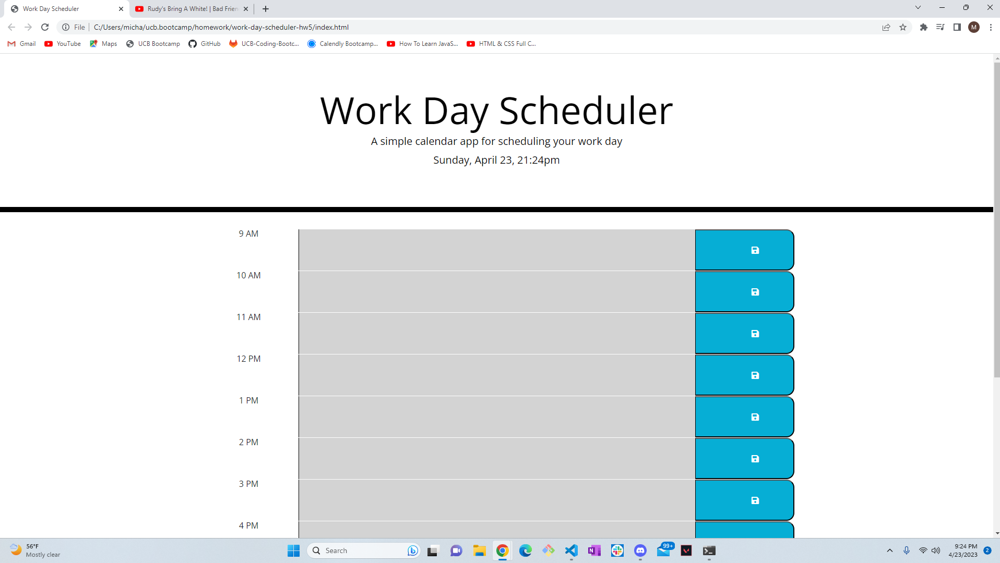
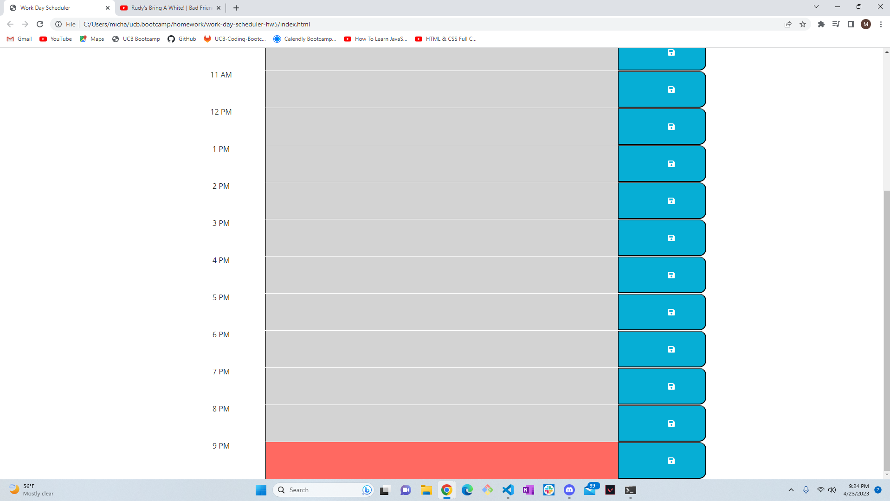

# work-day-scheduler-hw5

## Description

Work day scheduler for busy individuals.

To help users organize a busy day in the office.

The problem that this appication solves is being able to organize a hectic work day into a more organized and palatable day.

I learned how to code in current realtime to be displayed and code if the hour within that day has passed, is current, or coming up in the near future.

https://mmanhx90.github.io/work-day-scheduler-hw5/

